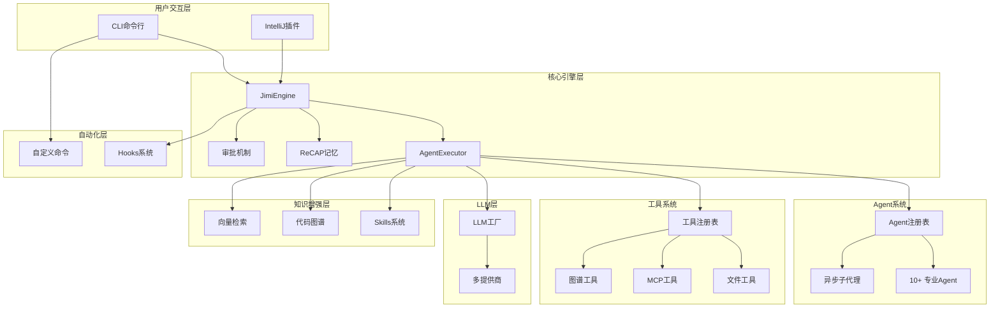

# Jimi - Java开发者的AI编程助手

> 纯Java实现的AI驱动智能代理系统，为Java开发者提供类Cursor IDE体验的开源CLI工具

[](https://www.oracle.com/java/)
[](https://spring.io/projects/spring-boot)
[](LICENSE)

## 📋 目录

- [核心特性](#-核心特性)
- [快速开始](#-快速开始)
- [系统架构](#-系统架构)
- [使用指南](#-使用指南)
- [扩展开发](#-扩展开发)
- [文档资源](#-文档资源)

## ✨ 核心特性

### 🤖 多Agent智能协作

内置10+专业Agent覆盖开发全流程：

| Agent | 职责 |
|-------|------|
| **Default** | 通用开发助手 |
| **Design** | 架构设计 |
| **Code** | 编码实现 |
| **Review** | 代码审查 |
| **Test** | 测试工程 |
| **Debug** | 错误诊断 |
| **Doc** | 文档编写 |
| **DevOps** | 部署运维 |

- 异步子代理：后台任务不阻塞主对话
- 动态切换：智能委派最合适的Agent
- YAML配置：无需编码自定义Agent

### 🪝 Hooks自动化系统

事件驱动的工作流自动化：

```yaml
name: "auto-format-java"
trigger:
  type: "POST_TOOL_CALL"
  tools: ["WriteFile"]
  file_patterns: ["*.java"]
execution:
  type: "script"
  script: "google-java-format -i ${MODIFIED_FILES}"
```

支持工具调用、Agent切换、错误处理等多种触发时机。[详细文档](docs/HOOKS.md)

### 🔍 代码图谱系统

基于AST的代码理解与导航：

- AST解析：Java代码结构化分析
- 混合检索：图检索 + 向量检索
- 影响分析：代码修改影响范围评估
- 智能定位：自然语言快速定位代码

[详细文档](docs/GRAPH_GUIDE.md)

### ⚡ 自定义命令

YAML配置即可扩展命令：

```yaml
name: "quick-build"
aliases: ["qb"]
execution:
  type: "script"
  script: "mvn clean install"
```

支持Script、Agent、Composite三种执行类型。[详细文档](docs/CUSTOM_COMMANDS.md)

### 🧠 智能记忆管理

基于ReCAP论文的上下文优化：

- 有界活动提示：防止上下文无限增长
- 结构化恢复：父子Agent语义连续
- Token优化：节省30-50% Token消耗

[详细文档](docs/ReCAP记忆优化技术方案.md)

### 🧩 Skills技能包

领域知识模块化管理，关键词自动激活。[详细文档](docs/SKILLS_README.md)

### 🌐 RAG检索增强

本地向量索引，自动检索相关代码注入上下文。[详细文档](docs/RAG配置指南.md)

### 🔌 多模型支持

支持OpenAI、Moonshot、Qwen、DeepSeek、Claude、Ollama等主流LLM。

### 🌐 MCP协议集成

支持Model Context Protocol，集成外部工具服务（Git、GitHub、Database等）。

### 🛠️ 丰富工具生态

- 文件操作：读写、搜索、补丁
- Shell执行：命令执行、后台任务
- 网络工具：网页抓取、搜索
- 任务管理：同步/异步子Agent、待办事项
- 人机交互：AskHuman暂停等待输入
- 代码图谱：智能定位、影响分析

### 🔐 企业级特性

- 审批机制：敏感操作人工审批
- YOLO模式：自动批准所有操作
- 循环控制：防止无限循环
- 会话管理：持久化与断点恢复
- 上下文压缩：智能Token优化

## 🎯 快速开始

### 环境要求

- Java 17+
- Maven 3.6+
- macOS / Linux / Windows

### 一键安装

```bash
git clone https://github.com/leavesfly/Jimi.git
cd Jimi
./scripts/quick-install.sh
```

### 分步安装

```bash
# 1. 检查环境
./scripts/check-env.sh

# 2. 构建项目
./scripts/build.sh

# 3. 初始化配置
./scripts/init-config.sh

# 4. 启动Jimi
./scripts/start.sh

# 指定Agent启动
./scripts/start.sh --agent design

# YOLO模式
./scripts/start.sh --yolo
```

### 常用命令

| 命令 | 说明 |
|------|------|
| `/help` | 帮助信息 |
| `/status` | 系统状态 |
| `/tools` | 工具列表 |
| `/agents` | Agent列表 |
| `/graph build` | 构建代码图 |
| `/hooks list` | Hooks列表 |
| `/async list` | 异步任务 |
| `/reset` | 清除上下文 |

## 🏛️ 系统架构



### 技术栈

- **核心框架**: Spring Boot 3.2.5, WebFlux
- **命令行**: Picocli 4.7.6, JLine 3.25.1
- **数据处理**: Jackson 2.16.2, SnakeYAML 2.2
- **代码分析**: JavaParser 3.25.5
- **协议集成**: MCP SDK 0.12.1

## 📚 使用指南

### Agent使用

```bash
# 切换Agent
/switch design

# 查看Agent列表
/agents
```

自定义Agent：在`~/.jimi/agents/`创建`agent.yaml`和`system_prompt.md`。[详细文档](docs/SKILLS_README.md)

### Hooks自动化

在`~/.jimi/hooks/`目录下创建YAML配置文件：

```yaml
name: "auto-test"
trigger:
  type: "POST_TOOL_CALL"
  tools: ["WriteFile"]
  file_patterns: ["*Test.java"]
execution:
  type: "script"
  script: "mvn test -Dtest=${MODIFIED_FILE%.*}"
```

[详细文档](docs/HOOKS.md)

### 代码图谱

```bash
# 构建图谱
/graph build

# 查看统计
/graph stats

# 查询
"找到GraphManager类的定义位置"
```

[详细文档](docs/GRAPH_GUIDE.md)

### 自定义命令

在`~/.jimi/commands/`创建YAML配置：

```yaml
name: "quick-build"
aliases: ["qb"]
execution:
  type: "script"
  script: "mvn clean install"
```

[详细文档](docs/CUSTOM_COMMANDS.md)

### 异步任务

```bash
# 查看异步任务
/async list

# 查看状态
/async status <task_id>

# 取消任务
/async cancel <task_id>
```

## 🛠️ 扩展开发

### 自定义工具

```java
@Component
public class MyTool extends AbstractTool<MyTool.Params> {
    @Data
    public static class Params {
        @JsonProperty("input")
        private String input;
    }
    
    public MyTool() {
        super("my_tool", "我的工具", Params.class);
    }
    
    @Override
    public Mono<ToolResult> execute(Params params) {
        return Mono.just(ToolResult.ok("结果"));
    }
}
```

### 自定义Agent

在`~/.jimi/agents/my-agent/`创建`agent.yaml`和`system_prompt.md`。

```yaml
name: My Agent
model: gpt-4
tools:
  - read_file
  - my_tool
```

### IntelliJ插件

```bash
cd intellij-plugin
./gradlew buildPlugin
./gradlew runIde
```

[详细文档](intellij-plugin/README.md)

## 📚 文档资源

- [用户使用指南.md](用户使用指南.md) - 完整用户手册
- [HOOKS.md](docs/HOOKS.md) - Hooks系统指南
- [GRAPH_GUIDE.md](docs/GRAPH_GUIDE.md) - 代码图谱指南
- [CUSTOM_COMMANDS.md](docs/CUSTOM_COMMANDS.md) - 自定义命令
- [ReCAP记忆优化技术方案.md](docs/ReCAP记忆优化技术方案.md) - 记忆优化
- [async-subagent-design.md](docs/async-subagent-design.md) - 异步子代理
- [TECHNICAL_ARCHITECTURE.md](docs/TECHNICAL_ARCHITECTURE.md) - 技术架构

更多文档查看 [docs/](docs/) 目录。

## 🤝 贡献指南

欢迎贡献！

```bash
# Fork并克隆
git clone https://github.com/your-username/Jimi.git

# 创建分支
git checkout -b feature/my-feature

# 开发和测试
mvn clean test

# 提交更改
git commit -m "feat: add my feature"

# 推送并创建Pull Request
git push origin feature/my-feature
```

### 开发规范

- 遵循Java编码规范
- 编写单元测试
- 更新相关文档
- 保持向后兼容

## 📜 许可证

本项目采用 [Apache License 2.0](LICENSE) 许可证。

---

<div align="center">

**[⬆ 回到顶部](#jimi---java开发者的ai编程助手)**

Made with ❤️ by [Leavesfly](https://github.com/leavesfly)

</div>
