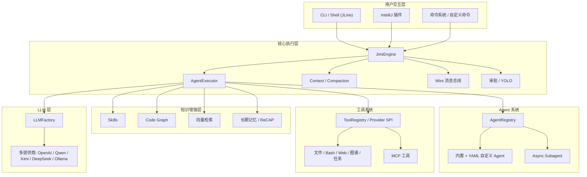
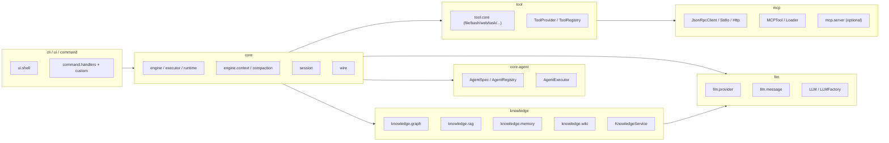

# Jimi 架构图与模块边界图

> 面向整体理解与模块边界清晰度的概要视图。

## 1) 架构图（系统视角）

```mermaid
graph TB
    subgraph User["用户交互层"]
        CLI["CLI / Shell (JLine)"]
        IDE["IntelliJ 插件"]
        Commands["命令系统 / 自定义命令"]
    end

    subgraph Core["核心执行层"]
        Engine["JimiEngine"]
        Executor["AgentExecutor"]
        Context["Context / Compaction"]
        Wire["Wire 消息总线"]
        Approval["审批 / YOLO"]
    end

    subgraph Agents["Agent 系统"]
        Registry["AgentRegistry"]
        AgentsSet["内置 + YAML 自定义 Agent"]
        Async["Async Subagent"]
    end

    subgraph Tools["工具系统"]
        ToolRegistry["ToolRegistry / Provider SPI"]
        BuiltinTools["文件 / Bash / Web / 图谱 / 任务"]
        MCPTools["MCP 工具"]
    end

    subgraph Knowledge["知识增强层"]
        Skills["Skills"]
        Graph["Code Graph"]
        RAG["向量检索"]
        Memory["长期记忆 / ReCAP"]
    end

    subgraph LLM["LLM 层"]
        LLMFactory["LLMFactory"]
        Providers["多提供商: OpenAI / Qwen / Kimi / DeepSeek / Ollama"]
    end

    CLI --> Engine
    IDE --> Engine
    Commands --> Engine

    Engine --> Executor
    Engine --> Context
    Engine --> Wire
    Engine --> Approval

    Executor --> Registry
    Registry --> AgentsSet
    Registry --> Async

    Executor --> ToolRegistry
    ToolRegistry --> BuiltinTools
    ToolRegistry --> MCPTools

    Executor --> Skills
    Executor --> Graph
    Executor --> RAG
    Executor --> Memory

    Executor --> LLMFactory
    LLMFactory --> Providers
```

## 2) 模块边界图（代码结构视角）

```mermaid
graph LR
    subgraph CLI["cli / ui / command"]
        UI["ui.shell"]
        Cmd["command.handlers + custom"]
    end

    subgraph Core["core"]
        Eng["engine / executor / runtime"]
        Ctx["engine.context / compaction"]
        Sess["session"]
        WireBus["wire"]
    end

    subgraph Agent["core.agent"]
        AgentSpec["AgentSpec / AgentRegistry"]
        AgentExec["AgentExecutor"]
    end

    subgraph Tool["tool"]
        ToolCore["tool.core (file/bash/web/task/...)"]
        ToolSPI["ToolProvider / ToolRegistry"]
    end

    subgraph Knowledge["knowledge"]
        GraphMod["knowledge.graph"]
        RagMod["knowledge.rag"]
        MemoryMod["knowledge.memory"]
        WikiMod["knowledge.wiki"]
        Unified["KnowledgeService"]
    end

    subgraph LLM["llm"]
        Provider["llm.provider"]
        Message["llm.message"]
        LLMCore["LLM / LLMFactory"]
    end

    subgraph MCP["mcp"]
        McpClient["JsonRpcClient / StdIo / Http"]
        McpTool["MCPTool / Loader"]
        McpServer["mcp.server (optional)"]
    end

    CLI --> Core
    Core --> Agent
    Core --> Tool
    Core --> Knowledge
    Core --> LLM
    Tool --> MCP
    Knowledge --> LLM
```

---

如需添加运行时序图（例如“用户输入 → 工具调用 → 上下文回写”），我可以再补一张。  
