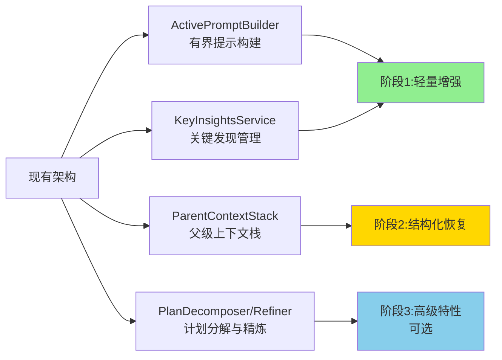
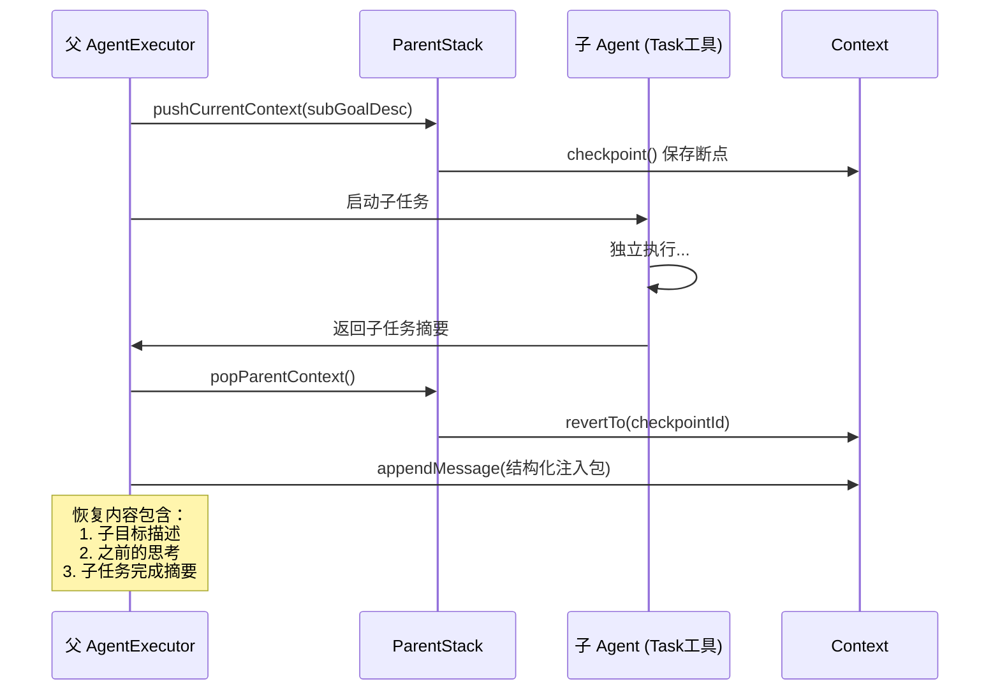
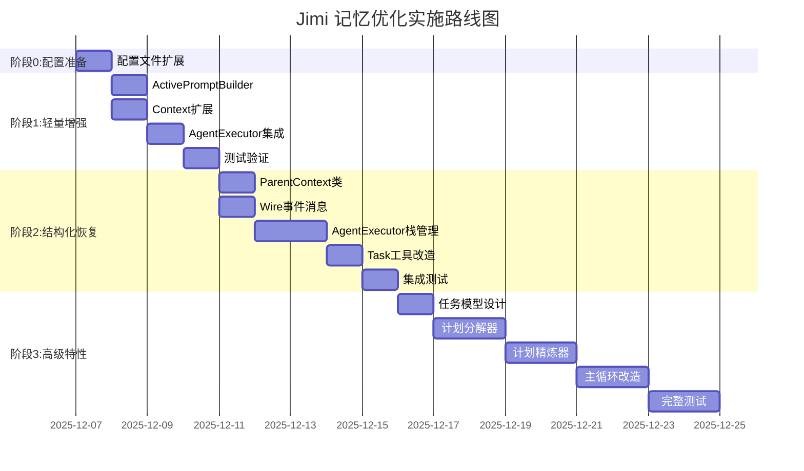

# Jimi 记忆模块优化技术方案

> 基于 ReCAP (Recursive Context-Aware Reasoning and Planning) 理念的渐进式优化方案  
> 版本：v1.0  
> 作成时间：2025-12-06

## 📋 目录

- [1. 背景与目标](#1-背景与目标)
- [2. 现状分析](#2-现状分析)
- [3. 核心策略](#3-核心策略)
- [4. 分阶段落地方案](#4-分阶段落地方案)
- [5. 实施路线图](#5-实施路线图)
- [6. 风险与缓解](#6-风险与缓解)
- [7. 验收标准](#7-验收标准)

---

## 1. 背景与目标

### 1.1 问题陈述

当前 Jimi 在长任务链与多 Subagent 协作场景下，存在以下记忆管理挑战：

| 问题 | 影响 | 严重程度 |
|------|------|---------|
| **上下文无限累积** | Token 数随步骤线性增长，触发频繁压缩 | ⚠️ 中 |
| **高层意图丢失** | 压缩后可能丢失初始目标，导致任务偏离 | ⚠️ 中 |
| **Subagent 记忆割裂** | 父子 Agent 间缺乏结构化记忆传递 | ⚠️ 中高 |
| **关键信息淹没** | 大量中间步骤稀释核心发现，LLM 难以聚焦 | ⚠️ 中 |

### 1.2 优化目标

借鉴 **ReCAP (NeurIPS 2025)** 的三大核心机制，实现：

1. ✅ **有界活动提示**：保持提示大小 O(1)，避免无限增长
2. ✅ **结构化上下文恢复**：父子 Agent 间语义连续性
3. ✅ **关键信息不丢失**：高层意图 + 摘要式关键发现始终保持

### 1.3 设计原则

- **插件式增强**：不重构核心执行流程，通过配置开关启用
- **渐进式落地**：分 3 阶段验证，每阶段可独立上线
- **充分复用**：利用现有 `Context.checkpoint()`、`Compaction`、Wire 机制
- **零破坏性**：旧逻辑可回退，灰度发布

---

## 2. 现状分析

### 2.1 现有架构优势（天然适配 ReCAP）

Jimi 当前架构已具备 ReCAP 所需的核心能力：

| 能力 | 现有实现 | 对应 ReCAP 机制 |
|------|---------|----------------|
| **检查点与回退** | `Context.checkpoint()` / `revertTo()` | 父级上下文恢复 |
| **上下文压缩** | `Compaction` 接口 + `checkAndCompactContext()` | 有界提示 |
| **Token 追踪** | `context.getTokenCount()` + LLM usage | 内存管理 |
| **Subagent 隔离** | `Task` 工具独立 Context/ToolRegistry | 递归层级 |
| **响应式架构** | Reactor Mono/Flux | 栈式恢复 |

### 2.2 需新增/扩展的模块



---

## 3. 核心策略

### 3.1 有界活动提示（Active Prompt）

**策略**：将"当前要用的记忆"精简成固定上限的活动提示。

```java
// 伪代码示例
ActivePromptBuilder.build() {
    // 1. Few-shot 只在顶层包含（避免每层重复）
    if (currentDepth == 0) {
        prompt += baseSystemPrompt;
    }
    
    // 2. 始终包含高层意图
    prompt += "## 高层目标\n" + highLevelIntent;
    
    // 3. 关键发现（滑窗压缩，最近5条）
    prompt += compressInsights(keyInsights.takeLast(5));
    
    // 4. 当前计划（仅包含未执行的任务）
    prompt += currentPlan.format();
    
    // 5. 超限截断（保留头尾）
    return truncateToLimit(prompt, MAX_TOKENS=4000);
}
```

**收益**：
- 提示大小从 O(n) 变为 O(1)
- 减少 LLM 调用 Token 消耗（预计节省 30-50%）

### 3.2 结构化上下文恢复（Structured Re-injection）

**策略**：父级上下文入栈 → 子任务执行 → 恢复父级并注入子任务摘要。



**收益**：
- 父任务语义连续性保持
- 支持递归 Subagent（最多 5 层）

### 3.3 关键发现压缩（Key Insights）

**策略**：提炼长历史观察为摘要式"关键发现"，滑窗进入活动提示。

```java
// 工具调用成功后提取关键发现
if (toolResult.isOk()) {
    String insight = extractInsight(toolResult);
    // 例如："发现配置文件存在认证bug，已修复并提交"
    context.addKeyInsight(insight);
}

// 完整历史保留（外部状态），摘要进入提示
List<String> recentInsights = context.getRecentInsights(5);
```

**收益**：
- 长历史不丢失核心信息
- LLM 聚焦关键线索

---

## 4. 分阶段落地方案

### 阶段 0：配置准备（立即可做，改造量 ★☆☆☆☆）

#### 目标
引入配置项，为后续功能开关做准备。

#### 改动内容

**1. 扩展 `application.yml`**

```yaml
jimi:
  memory:
    # 有界提示最大 Token 数
    activePromptMaxTokens: 4000
    
    # 关键发现窗口大小（最近 N 条进入提示）
    insightsWindowSize: 5
    
    # 是否启用 ReCAP 优化（默认关闭）
    enableRecap: false
    
    # 最大递归深度
    maxRecursionDepth: 5
```

**2. 新增配置类 `MemoryConfig.java`**

```java
// src/main/java/io/leavesfly/jimi/config/MemoryConfig.java
package io.leavesfly.jimi.config;

import lombok.Data;
import org.springframework.boot.context.properties.ConfigurationProperties;
import org.springframework.stereotype.Component;

@Data
@Component
@ConfigurationProperties(prefix = "jimi.memory")
public class MemoryConfig {
    
    /**
     * 有界提示最大 Token 数
     */
    private int activePromptMaxTokens = 4000;
    
    /**
     * 关键发现窗口大小
     */
    private int insightsWindowSize = 5;
    
    /**
     * 是否启用 ReCAP 优化
     */
    private boolean enableRecap = false;
    
    /**
     * 最大递归深度
     */
    private int maxRecursionDepth = 5;
}
```

#### 验收标准
- [ ] 配置文件可解析
- [ ] `MemoryConfig` Bean 正常注入
- [ ] 启动日志显示配置值

#### 工作量
**0.5 天**

---

### 阶段 1：轻量增强（有界提示 + 关键发现，改造量 ★★☆☆☆）

#### 目标
实现"有界活动提示"与"关键发现管理"，提升提示质量与 Token 控制。

#### 核心组件

##### 1. `ActivePromptBuilder` 类（~100 行）

```java
// src/main/java/io/leavesfly/jimi/engine/context/ActivePromptBuilder.java
package io.leavesfly.jimi.engine.context;

import io.leavesfly.jimi.config.info.MemoryConfig;
import lombok.extern.slf4j.Slf4j;
import org.springframework.stereotype.Component;

import java.util.List;
import java.util.stream.Collectors;

/**
 * 有界活动提示构建器
 * 基于 ReCAP 理念，保持提示大小 O(1)
 */
@Slf4j
@Component
public class ActivePromptBuilder {

    private final MemoryConfig config;

    public ActivePromptBuilder(MemoryConfig config) {
        this.config = config;
    }

    /**
     * 构建增强的系统提示
     *
     * @param baseSystemPrompt 基础系统提示词
     * @param highLevelIntent 高层意图（从首条用户消息提取）
     * @param keyInsights 关键发现列表
     * @param currentDepth 当前递归深度
     * @return 增强后的提示
     */
    public String buildEnhancedPrompt(
            String baseSystemPrompt,
            String highLevelIntent,
            List<String> keyInsights,
            int currentDepth
    ) {
        StringBuilder prompt = new StringBuilder();

        // 1. Few-shot 只在顶层包含
        if (currentDepth == 0) {
            prompt.append(baseSystemPrompt);
        }

        // 2. 高层意图始终保持
        if (highLevelIntent != null && !highLevelIntent.isEmpty()) {
            prompt.append("\n\n## 🎯 高层目标\n");
            prompt.append(highLevelIntent);
        }

        // 3. 关键发现（滑窗压缩）
        if (keyInsights != null && !keyInsights.isEmpty()) {
            prompt.append("\n\n## 💡 关键发现\n");
            prompt.append(compressInsights(keyInsights));
        }

        // 4. 截断到限制
        String result = prompt.toString();
        return truncateToLimit(result);
    }

    /**
     * 压缩关键发现：只保留最近 N 条
     */
    private String compressInsights(List<String> insights) {
        int windowSize = config.getInsightsWindowSize();
        int start = Math.max(0, insights.size() - windowSize);

        return insights.subList(start, insights.size())
                .stream()
                .map(s -> "- " + s)
                .collect(Collectors.joining("\n"));
    }

    /**
     * 截断到 Token 限制（保留开头和结尾）
     */
    private String truncateToLimit(String text) {
        int estimatedTokens = estimateTokens(text);
        int maxTokens = config.getActivePromptMaxTokens();

        if (estimatedTokens <= maxTokens) {
            return text;
        }

        log.warn("Prompt 超限 (估算: {} tokens, 上限: {} tokens)，执行截断",
                estimatedTokens, maxTokens);

        // 简单策略：保留前 1/3 和后 2/3 的字符
        int targetChars = (int) (text.length() * maxTokens / (double) estimatedTokens);
        int headLen = targetChars / 3;
        int tailLen = targetChars * 2 / 3;

        return text.substring(0, headLen)
                + "\n\n...[已截断中间内容]...\n\n"
                + text.substring(text.length() - tailLen);
    }

    /**
     * 估算 Token 数量（字符数 / 4）
     */
    private int estimateTokens(String text) {
        return (int) Math.ceil(text.length() / 4.0);
    }
}
```

##### 2. 扩展 `Context` 类（~40 行新增）

```java
// 在 Context.java 中新增字段和方法

/**
 * 关键发现列表（外部状态，完整保留）
 */
private final List<String> keyInsights = new ArrayList<>();

/**
 * 高层意图（从首条用户消息提取）
 */
private String highLevelIntent;

/**
 * 添加关键发现
 * 
 * @param insight 发现内容
 * @return 完成的 Mono
 */
public Mono<Void> addKeyInsight(String insight) {
    return Mono.defer(() -> {
        if (insight == null || insight.trim().isEmpty()) {
            return Mono.empty();
        }
        
        keyInsights.add(insight);
        log.debug("添加关键发现 (总数: {}): {}", keyInsights.size(), insight);
        
        // 保持最近 20 条（窗口压缩）
        if (keyInsights.size() > 20) {
            keyInsights.remove(0);
        }
        
        return Mono.empty();
    });
}

/**
 * 获取最近的关键发现
 * 
 * @param n 数量
 * @return 发现列表
 */
public List<String> getRecentInsights(int n) {
    int start = Math.max(0, keyInsights.size() - n);
    return new ArrayList<>(keyInsights.subList(start, keyInsights.size()));
}

/**
 * 设置高层意图
 */
public void setHighLevelIntent(String intent) {
    this.highLevelIntent = intent;
}

/**
 * 获取高层意图
 */
public String getHighLevelIntent() {
    return highLevelIntent;
}
```

##### 3. 集成到 `AgentExecutor`（~30 行改动）

```java
// 在 AgentExecutor 中注入和使用

private final ActivePromptBuilder promptBuilder;  // 新增字段
private final MemoryConfig memoryConfig;          // 新增字段

// 构造函数注入
public AgentExecutor(
        // ... existing params ...
        ActivePromptBuilder promptBuilder,
        MemoryConfig memoryConfig
) {
    this.promptBuilder = promptBuilder;
    this.memoryConfig = memoryConfig;
}

/**
 * 执行单步（改造）
 */
private Mono<Boolean> step() {
    return Mono.defer(() -> {
        LLM llm = runtime.getLlm();
        List<Object> toolSchemas = new ArrayList<>(toolRegistry.getToolSchemas(agent.getTools()));
        
        // 构建增强的系统提示（如果启用 ReCAP）
        String systemPrompt = agent.getSystemPrompt();
        if (memoryConfig.isEnableRecap()) {
            systemPrompt = promptBuilder.buildEnhancedPrompt(
                    agent.getSystemPrompt(),
                    context.getHighLevelIntent(),
                    context.getRecentInsights(memoryConfig.getInsightsWindowSize()),
                    currentDepth
            );
            log.debug("使用 ReCAP 增强提示 (depth: {})", currentDepth);
        }
        
        return llm.getChatProvider()
                .generateStream(systemPrompt, context.getHistory(), toolSchemas)
    });
}

/**
 * 执行任务入口（提取高层意图）
 */
public Mono<Void> execute(List<ContentPart> userInput) {
    return Mono.defer(() -> {
        Message userMessage = Message.user(userInput);
        
        // 提取高层意图（首条用户消息）
        if (memoryConfig.isEnableRecap() && context.getHistory().isEmpty()) {
            String intent = extractHighLevelIntent(userInput);
            context.setHighLevelIntent(intent);
            log.info("提取高层意图: {}", intent);
        }
        
    });
}

/**
 * 提取高层意图（简化版：取用户输入的前 200 字符）
 */
private String extractHighLevelIntent(List<ContentPart> userInput) {
    String fullText = userInput.stream()
            .filter(part -> part instanceof TextPart)
            .map(part -> ((TextPart) part).getText())
            .collect(Collectors.joining(" "));
    
    return fullText.length() > 200 
            ? fullText.substring(0, 200) + "..." 
            : fullText;
}

/**
 * 工具调用成功后提取关键发现
 */
private Message convertToolResultToMessage(ToolResult result, String toolCallId, String toolSignature) {
    String content;
    
    if (result.isOk()) {
        toolErrorTracker.clearErrors();
        content = formatToolResult(result);
        
        // 提取关键发现（如果启用 ReCAP）
        if (memoryConfig.isEnableRecap()) {
            String insight = extractInsightFromToolResult(result, toolSignature);
            if (insight != null) {
                context.addKeyInsight(insight).subscribe();
            }
        }
    } else {
        // ... existing error handling ...
    }
    
    return Message.tool(toolCallId, content);
}

/**
 * 从工具结果提取关键发现（简化版：取输出的前 100 字符）
 */
private String extractInsightFromToolResult(ToolResult result, String toolSignature) {
    String output = result.getOutput();
    if (output == null || output.isEmpty()) {
        return null;
    }
    
    String preview = output.length() > 100 
            ? output.substring(0, 100) + "..." 
            : output;
    
    return String.format("[%s] %s", toolSignature.split(":")[0], preview);
}
```

##### 4. 工厂类注入改造（~10 行）

```java
// 在 JimiFactory 中注入 ActivePromptBuilder

@Autowired
private ActivePromptBuilder promptBuilder;  // 新增

@Autowired
private MemoryConfig memoryConfig;          // 新增

// 创建 AgentExecutor 时传入
AgentExecutor executor = new AgentExecutor(
        agent, runtime, context, wire, toolRegistry, compaction,
        isSubagent, skillMatcher, skillProvider, retrievalPipeline,
        promptBuilder,    // 新增
        memoryConfig      // 新增
);
```

#### 验收标准
- [ ] 启用 `enableRecap=true` 后，日志显示"使用 ReCAP 增强提示"
- [ ] 提示长度不超过配置的 `activePromptMaxTokens`
- [ ] 工具调用成功后，`keyInsights` 列表增长
- [ ] 高层意图在首次用户输入时被提取并保持
- [ ] 禁用 `enableRecap=false` 后，行为与旧逻辑一致

#### 工作量
**2 天**

---

### 阶段 2：结构化恢复（父级上下文栈，改造量 ★★★☆☆）

#### 目标
支持父级上下文栈与结构化恢复，提升 Subagent 协作的记忆传递质量。

#### 核心组件

##### 1. `ParentContext` 数据类（~50 行）

```java
// src/main/java/io/leavesfly/jimi/engine/runtime/ParentContext.java
package io.leavesfly.jimi.engine.runtime;

import lombok.Data;

/**
 * 父级上下文（栈元素）
 * 用于递归/Subagent 场景的上下文恢复
 */
@Data
public class ParentContext {
    
    /**
     * 父级检查点 ID
     */
    private final int checkpointId;
    
    /**
     * 最近的思考内容
     */
    private final String latestThought;
    
    /**
     * 递归深度
     */
    private final int depth;
    
    /**
     * 子目标描述
     */
    private final String subGoalDescription;
    
    /**
     * 保存时间戳（用于调试）
     */
    private final long timestamp;
    
    public ParentContext(int checkpointId, String latestThought, 
                        int depth, String subGoalDescription) {
        this.checkpointId = checkpointId;
        this.latestThought = latestThought;
        this.depth = depth;
        this.subGoalDescription = subGoalDescription;
        this.timestamp = System.currentTimeMillis();
    }
    
    /**
     * 格式化为结构化注入文本
     */
    public String formatForInjection() {
        return String.format("""
                === 父级上下文恢复 (深度: %d) ===
                子目标: %s
                之前的思考: %s
                """, depth, subGoalDescription, latestThought);
    }
}
```

##### 2. Wire 事件消息类（~60 行）

```java
// src/main/java/io/leavesfly/jimi/wire/message/SubagentStarting.java
package io.leavesfly.jimi.wire.message;

import lombok.Data;
import lombok.EqualsAndHashCode;

/**
 * Subagent 启动事件
 */
@Data
@EqualsAndHashCode(callSuper = true)
public class SubagentStarting extends WireMessage {
    private final String subagentName;
    private final String prompt;
    
    public SubagentStarting(String subagentName, String prompt) {
        super("subagent_starting");
        this.subagentName = subagentName;
        this.prompt = prompt;
    }
}

// src/main/java/io/leavesfly/jimi/wire/message/SubagentCompleted.java
package io.leavesfly.jimi.wire.message;

import lombok.Data;
import lombok.EqualsAndHashCode;

/**
 * Subagent 完成事件
 */
@Data
@EqualsAndHashCode(callSuper = true)
public class SubagentCompleted extends WireMessage {
    private final String summary;
    
    public SubagentCompleted(String summary) {
        super("subagent_completed");
        this.summary = summary;
    }
}
```

##### 3. 扩展 `AgentExecutor`（~120 行新增）

```java
// 在 AgentExecutor 中新增字段和方法

/**
 * 父级上下文栈
 */
private final Deque<ParentContext> parentStack = new ArrayDeque<>();

/**
 * 当前递归深度
 */
private int currentDepth = 0;

/**
 * Push 父级上下文（在启动 Subagent 前调用）
 * 
 * @param subGoalDesc 子目标描述
 * @return 完成的 Mono
 */
public Mono<Void> pushCurrentContext(String subGoalDesc) {
    if (!memoryConfig.isEnableRecap()) {
        return Mono.empty();
    }
    
    return Mono.defer(() -> {
        // 检查递归深度限制
        if (currentDepth >= memoryConfig.getMaxRecursionDepth()) {
            log.warn("达到最大递归深度 {}, 不再入栈", memoryConfig.getMaxRecursionDepth());
            return Mono.empty();
        }
        
        // 创建检查点
        return context.checkpoint(false)
                .map(checkpointId -> {
                    String latestThought = extractLatestThought();
                    
                    ParentContext parent = new ParentContext(
                            checkpointId,
                            latestThought,
                            currentDepth,
                            subGoalDesc
                    );
                    
                    parentStack.push(parent);
                    currentDepth++;
                    
                    log.info("Push 父级上下文 (depth: {} -> {}, checkpoint: {})", 
                            parent.getDepth(), currentDepth, checkpointId);
                    
                    return parent;
                })
                .then();
    });
}

/**
 * Restore 父级上下文（在 Subagent 完成后调用）
 * 
 * @param childSummary 子任务完成摘要
 * @return 完成的 Mono
 */
public Mono<Void> restoreParentContext(String childSummary) {
    if (!memoryConfig.isEnableRecap() || parentStack.isEmpty()) {
        return Mono.empty();
    }
    
    return Mono.defer(() -> {
        ParentContext parent = parentStack.pop();
        currentDepth = parent.getDepth();
        
        log.info("Restore 父级上下文 (depth: {} <- {}, checkpoint: {})", 
                currentDepth, currentDepth + 1, parent.getCheckpointId());
        
        // 回退到父级检查点
        return context.revertTo(parent.getCheckpointId())
                .then(Mono.defer(() -> {
                    // 注入结构化恢复消息
                    String injectionMsg = parent.formatForInjection() 
                            + "\n## 子目标完成摘要\n" 
                            + childSummary;
                    
                    return context.appendMessage(Message.user(injectionMsg));
                }))
                .doOnSuccess(v -> log.debug("结构化注入完成"));
    });
}

/**
 * 提取最新思考（从最后一条 assistant 消息）
 */
private String extractLatestThought() {
    List<Message> history = context.getHistory();
    
    for (int i = history.size() - 1; i >= 0; i--) {
        Message msg = history.get(i);
        if (msg.getRole() == MessageRole.ASSISTANT) {
            String content = msg.getTextContent();
            if (content != null && !content.isEmpty()) {
                return content.length() > 200 
                        ? content.substring(0, 200) + "..." 
                        : content;
            }
        }
    }
    
    return "(无)";
}

/**
 * 在构造函数中订阅 Wire 事件
 */
public AgentExecutor(/* ... params ... */) {
    
    // 订阅 Subagent 启动事件
    wire.asFlux()
            .ofType(SubagentStarting.class)
            .subscribe(event -> {
                log.debug("收到 SubagentStarting 事件: {}", event.getSubagentName());
                pushCurrentContext(event.getPrompt()).subscribe();
            });
    
    // 订阅 Subagent 完成事件
    wire.asFlux()
            .ofType(SubagentCompleted.class)
            .subscribe(event -> {
                log.debug("收到 SubagentCompleted 事件");
                restoreParentContext(event.getSummary()).subscribe();
            });
}
```

##### 4. 改造 `Task` 工具（~25 行改动）

```java
// 在 Task.java 的 runSubagent 方法中发送事件

private Mono<ToolResult> runSubagent(Agent agent, String prompt) {
    return Mono.defer(() -> {
        try {
            // 1. 发送 Subagent 启动事件
            parentWire.send(new SubagentStarting(agent.getName(), prompt));
            
            // 2. 子历史文件
            Path subHistoryFile = getSubagentHistoryFile(agent.getName());
            
            // 3. 子上下文
            Context subContext = createSubContext(subHistoryFile);
            
            // 4. 子工具注册表
            ToolRegistry subToolRegistry = createSubToolRegistry();
            
            // 5. 子 JimiEngine
            JimiEngine subEngine = createSubSoul(agent, subContext, subToolRegistry);
            
            // 6. 事件桥接
            Disposable subscription = bridgeWireEvents(subEngine.getWire());
            
            // 7. 运行并后处理
            return subEngine.run(prompt)
                    .then(Mono.defer(() -> extractFinalResponse(subContext, subEngine, prompt)))
                    .doOnSuccess(result -> {
                        // 8. 发送 Subagent 完成事件（附带摘要）
                        String summary = result.getOutput();
                        parentWire.send(new SubagentCompleted(summary));
                    })
                    .doFinally(signalType -> {
                        if (subscription != null && !subscription.isDisposed()) {
                            subscription.dispose();
                        }
                    });
            
        } catch (Exception e) {
            log.error("Error running subagent", e);
            return Mono.just(ToolResult.error(
                    e.getMessage(),
                    "Failed to run subagent"
            ));
        }
    });
}
```

#### 验收标准
- [ ] 启动 Subagent 前，日志显示"Push 父级上下文"
- [ ] Subagent 完成后，日志显示"Restore 父级上下文"
- [ ] 父级 Context 历史中包含结构化注入消息
- [ ] `parentStack` 大小在递归过程中正确增减
- [ ] 达到最大递归深度时，拒绝继续入栈

#### 工作量
**4 天**

---

### 阶段 3：高级特性（计划分解与精炼，可选，改造量 ★★★★☆）

#### 目标
引入 Plan-ahead 任务分解与动态精炼机制（适用于复杂任务场景）。

#### 核心组件

##### 1. 任务模型类（~150 行）

```java
// src/main/java/io/leavesfly/jimi/engine/planning/SubTask.java
package io.leavesfly.jimi.engine.planning;

import lombok.Data;

@Data
public class SubTask {
    private String id;
    private String description;
    private TaskType type;       // ATOMIC / COMPOSITE
    private TaskStatus status;   // PENDING / COMPLETED / SKIPPED
    private int complexity;      // 1-10
    
    public boolean needsDecomposition() {
        return type == TaskType.COMPOSITE && complexity > 5;
    }
}

// src/main/java/io/leavesfly/jimi/engine/planning/SubTaskList.java
public class SubTaskList {
    private final LinkedList<SubTask> tasks;
    
    public SubTask popHead() { /* ... */ }
    public void add(SubTask task) { /* ... */ }
    public boolean isEmpty() { /* ... */ }
    public String format() { /* ... */ }
}
```

##### 2. 计划分解器（~200 行）

```java
// src/main/java/io/leavesfly/jimi/engine/planning/PlanDecomposer.java
public class PlanDecomposer {
    
    public SubTaskList decompose(String query) {
        // 分析查询类型
        QueryType type = analyzeQueryType(query);
        
        // 根据类型生成完整任务列表
        List<SubTask> tasks = generateTasksByType(type, query);
        
        // 估算复杂度
        tasks.forEach(task -> {
            task.setComplexity(estimateComplexity(task.getDescription()));
        });
        
        return new SubTaskList(tasks);
    }
}
```

##### 3. 计划精炼器（~200 行）

```java
// src/main/java/io/leavesfly/jimi/engine/planning/PlanRefiner.java
public class PlanRefiner {
    
    public SubTaskList refine(SubTaskList plan, 
                             ToolResult lastResult,
                             String highLevelIntent) {
        // 基于执行结果决定：保持/跳过/修改/拆分
        RefineDecision decision = analyzeAndDecide(plan, lastResult, highLevelIntent);
        
        return applyDecision(plan, decision);
    }
}
```

##### 4. 改造主循环（~100 行改动）

```java
// 在 AgentExecutor 中引入计划驱动的执行循环

private SubTaskList currentPlan;  // 当前计划

private Mono<Void> agentLoopStep(int stepNo) {
    return Mono.defer(() -> {
        // 如果计划为空，尝试生成计划
        if (currentPlan == null || currentPlan.isEmpty()) {
            if (parentStack.isEmpty()) {
                return Mono.empty();  // 任务完成
            } else {
                return restoreParentContext(null)
                        .then(agentLoopStep(stepNo + 1));
            }
        }
        
        // 弹出头部任务
        SubTask headTask = currentPlan.popHead();
        
        // 判断是否需要递归分解
        if (headTask.needsDecomposition() 
                && currentDepth < memoryConfig.getMaxRecursionDepth()) {
            // Push 父级上下文
            return pushCurrentContext(headTask.getDescription())
                    .then(Mono.defer(() -> {
                        // 分解子目标
                        currentPlan = planDecomposer.decompose(headTask.getDescription());
                        return agentLoopStep(stepNo + 1);
                    }));
        } else {
            // 执行原子任务
            return executeAtomicTask(headTask)
                    .flatMap(result -> {
                        // 精炼剩余计划
                        currentPlan = planRefiner.refine(
                                currentPlan, 
                                result, 
                                context.getHighLevelIntent()
                        );
                        return agentLoopStep(stepNo + 1);
                    });
        }
    });
}
```

#### 验收标准
- [ ] 复杂任务能够被分解为子任务列表
- [ ] 头部任务执行后，剩余计划被正确精炼
- [ ] 日志显示任务分解与精炼决策

#### 工作量
**7-10 天**（可选，建议在阶段 1/2 验证后评估需求）

---

## 5. 实施路线图



**总工作量估算**：
- 阶段 0：0.5 天
- 阶段 1：3 天
- 阶段 2：5 天
- 阶段 3：9 天（可选）

**推荐路径**：先完成阶段 0-2（共 8.5 天），在生产环境验证 2-4 周后，根据反馈决定是否实施阶段 3。

---

## 6. 风险与缓解

| 风险 | 影响 | 概率 | 缓解措施 |
|------|------|------|---------|
| **提示构建逻辑冲突** | 中 | 低 | 配置开关控制，旧逻辑可回退 |
| **Token 估算不准确** | 低 | 中 | 复用现有 `estimateTokensFromMessage()`，LLM usage 优先 |
| **栈式恢复引入状态复杂度** | 中高 | 中 | 严格日志 + 单元测试覆盖 + 最大深度限制 |
| **Subagent Wire 事件顺序问题** | 中 | 中 | 使用 Reactor `concatMap` 保证顺序性 |
| **长文本截断损失关键信息** | 中 | 低 | 头尾保留策略 + 关键发现单独管理 |
| **兼容性问题** | 高 | 低 | 灰度发布 + A/B 测试 |

---

## 7. 验收标准

### 阶段 1 验收
- [ ] 配置 `enableRecap=true` 后，提示长度不超过 `activePromptMaxTokens`
- [ ] 高层意图在所有步骤中保持可见
- [ ] 关键发现列表正常增长，窗口压缩生效
- [ ] Token 消耗相比旧逻辑降低 20-30%

### 阶段 2 验收
- [ ] Subagent 启动/完成事件正常触发
- [ ] 父级上下文正确入栈/出栈
- [ ] 结构化注入消息包含完整的父级信息
- [ ] 递归深度限制生效

### 阶段 3 验收（可选）
- [ ] 复杂任务能够被分解为有序子任务列表
- [ ] 执行后计划精炼逻辑正确
- [ ] 支持 COMPOSITE 任务的递归分解

### 整体验收
- [ ] 所有单元测试通过
- [ ] 集成测试覆盖主要场景
- [ ] 文档完备（技术方案 + API 文档 + 配置说明）
- [ ] 性能指标达标（Token 消耗降低、执行时间无明显增加）

---

## 8. 后续优化方向

### 8.1 短期优化（3 个月内）
1. **智能 Insight 提取**：使用 LLM 提炼关键发现，而非简单截断
2. **动态窗口调整**：根据任务复杂度动态调整 `insightsWindowSize`
3. **并行任务执行**：独立原子任务可并行执行

### 8.2 中期优化（6 个月内）
1. **缓存机制**：缓存相似任务的分解结果
2. **早停策略**：达到目标后提前终止
3. **可视化执行轨迹**：展示递归层级与计划精炼过程

### 8.3 长期优化（1 年内）
1. **多模态记忆**：支持图像、代码等非文本记忆
2. **记忆检索增强**：与现有 RAG 系统深度融合
3. **联邦记忆**：跨会话的记忆共享与迁移

---

## 9. 参考资料

### 论文
- **ReCAP原论文**: [Recursive Context-Aware Reasoning and Planning for LLM Agents](https://github.com/ReCAP-Stanford/ReCAP) (NeurIPS 2025)
- **ReAct论文**: Yao et al., "ReAct: Synergizing Reasoning and Acting in Language Models"

### 内部文档
- [Jimi 系统架构](../README.md)
- [Subagent 机制文档](./SUBAGENT.md)
- [上下文压缩设计](./CONTEXT_COMPACTION.md)

### 相关代码
- [JimiEngine.java](../src/main/java/io/leavesfly/jimi/core/engine/JimiEngine.java)
- [AgentExecutor.java](../src/main/java/io/leavesfly/jimi/core/engine/AgentExecutor.java)
- [Context.java](../src/main/java/io/leavesfly/jimi/core/engine/context/Context.java)
- [Task.java](../src/main/java/io/leavesfly/jimi/tool/core/task/Task.java)

---

**文档版本**: v1.0  
**最后更新**: 2025-12-06  
**作者**: Jimi Team  
**审核状态**: ✅ 待审核
